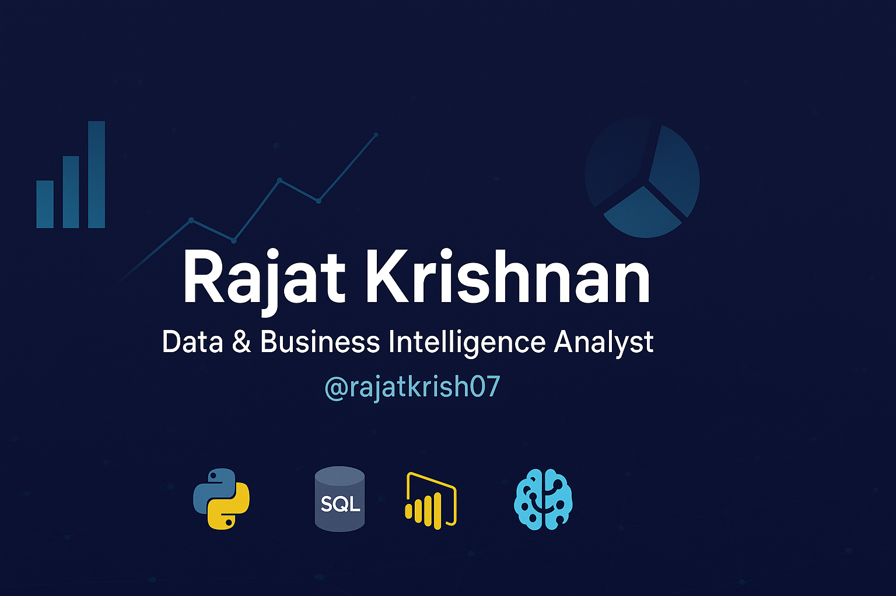

<h1 align="center">
  
</h1>

<h2 align="center">👋 Hi, I'm Rajat Krishnan</h2>
<h3 align="center">💡 Data & Business Intelligence Analyst | Bridging Data Engineering & Analytics for Smarter Decisions</h3>

---

  🌐 <b>Currently advancing my skills in:</b> Data Engineering & Analytics  
  📧 <b>Reach me at:</b> <a href="mailto:rajatkrishnan2002@gmail.com">rajatkrishnan2002@gmail.com</a>

---

<h3 align="center">🌐 Connect with Me</h3>

  
  

---

<h3 align="center">🛠️ Languages & Tools</h3>

<h4>Programming Languages:</h4>

  
  
  
  
  

<h4>Data & Productivity Tools:</h4>

  <!-- Power BI (official MS icon, reliable source) -->
  
  
  
  
  
  

---

<h3 align="left">🚀 Currently Working On</h3>

- Building **ETL pipelines** for data processing  
- Developing interactive dashboards in **Power BI**  
- Enhancing skills in **Data Engineering (SQL, PostgreSQL, Python)**  
- Exploring **Machine Learning** for predictive analytics  

---

<h3 align="center">✨ Featured Skills</h3>

  
  
  
  

