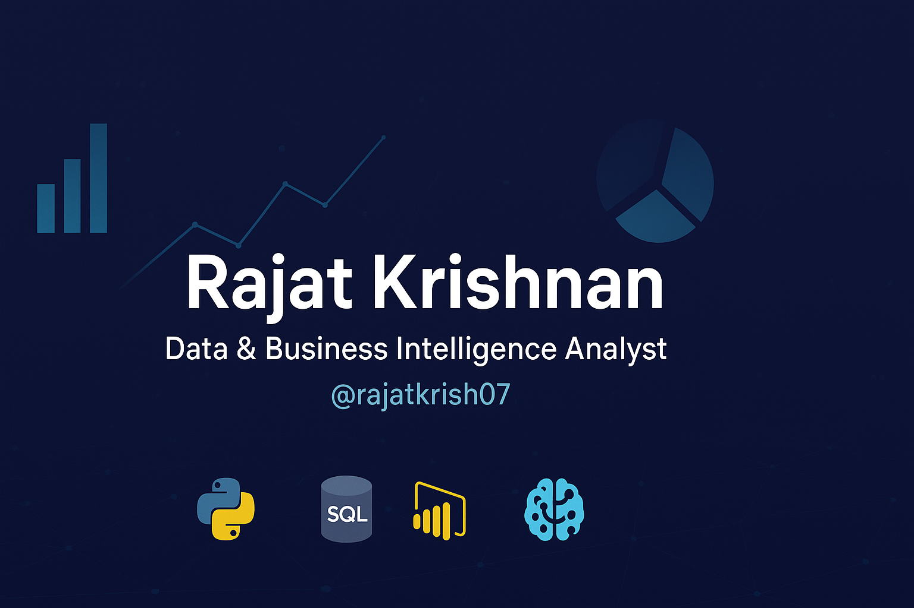

<h1 align="center">
  
</h1>

<h2 align="center">👋 Hi, I'm Rajat Krishnan</h2>
<h3 align="center">💡 Data & Business Intelligence Analyst | AI / GenAI Enthusiast</h3>

  🌐 <b>Currently advancing my skills in:</b> Generative AI, RAG & Data Engineering  
  📧 <b>Reach me at:</b> <a href="mailto:rajatkrishnan2002@gmail.com">rajatkrishnan2002@gmail.com</a>

<h3 align="center">🌐 Connect with Me</h3>

  
  
  

 

## 🧠 Skills & Tech Stack

### 🔤 Programming Languages

  
  
  

### 🤖 GenAI & ML

  
  
  
  
  
  
  

### ⚙️ Backend & APIs

  
  
  
  
  

### 🗄️ Database

  

### 🛠️ Dev Tools & Workflow

  
  
  
  
  
  

 

## 🚀 Currently Working On
- Building **RAG pipelines** using LangChain, LangGraph & vector databases (ChromaDB, FAISS)
- Developing **FastAPI-based** backend services with Pydantic & SQLAlchemy
- Writing **REST APIs** backed by PostgreSQL
- Testing workflows with **Pytest** and **Postman**
- Exploring **LLM-powered applications** and prompt engineering techniques
